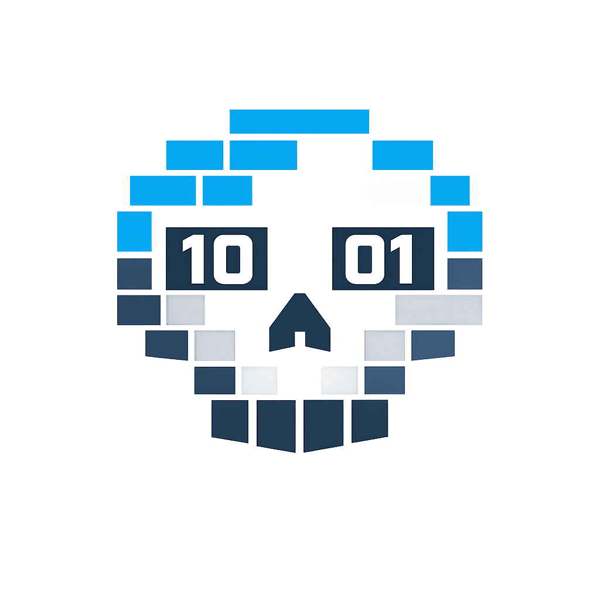

<p align="center">
  
</p>

# ArPack


Binary serialization code generator for Go, C#, TypeScript, Lua, and GameMaker (2.3+).

Define wire messages as Go structs, then generate compact little-endian serializers for every target. ArPack is intentionally narrow: it is built for owned protocols where predictable layout, cross-language compatibility, and low runtime overhead matter more than schema evolution features.

## Install

```bash
go install github.com/edmand46/arpack/cmd/arpack@latest
```

## Generate

```bash
arpack \
  -in messages/messages.go \
  -out-go messages \
  -out-cs client/Messages \
  -out-ts web/src/messages \
  -out-lua defold/scripts/messages \
  -out-gml GameMaker/scripts/src_arpack
```

| Flag | Purpose |
| --- | --- |
| `-in` | Input Go schema file, repeatable |
| `-name` | Base name for generated output files; required when multiple `-in` are given |
| `-out-go` | Generated Go methods, co-located with the schema package |
| `-out-cs` | Generated C# files |
| `-out-ts` | Generated TypeScript files |
| `-out-lua` | Generated Lua files |
| `-out-gml` | Generated GameMaker Language (GML) files |
| `-cs-namespace` | C# namespace, default `Arpack.Messages` |

Output names:

| Target | File                     |
| --- |--------------------------|
| Go | `{name}_gen.go`          |
| C# | `{Name}.gen.cs`          |
| TypeScript | `{Name}.gen.ts`          |
| Lua | `{name}_gen.lua`         |
| GML | `{folder}/{folder}.gml`  |

## Schema

Schemas are Go files. Message structs, nested message structs, enum types, and enum constants must be defined in the schema files.

Multiple `-in` files are merged into one output file per target. Files sharing a package name are type-checked together (cross-file references work within a package); different packages are parsed independently and merged. Type names must be unique across all inputs — e.g. system messages from a framework and game messages from your project:

```bash
arpack \
  -in vendor/framework/messages.go \
  -in game/messages.go \
  -name messages \
  -out-cs client/Messages
```

Cross-package type references (`framework.Vec3` in a game struct) are not supported; shared structs must live in one of the inputs.

```go
package messages

type Opcode uint16

const (
    OpcodeUnknown Opcode = iota
    OpcodeMove
)

type Vector3 struct {
    X float32 `pack:"min=-500,max=500,bits=16"`
    Y float32 `pack:"min=-500,max=500,bits=16"`
    Z float32 `pack:"min=-500,max=500,bits=16"`
}

type MoveMessage struct {
    Op       Opcode
    PlayerID uint32
    Position Vector3
    Velocity [3]float32
    Trail    []Vector3
    Active   bool
    Visible  bool
    Name     string
}
```

Supported field shapes:

| Kind | Notes |
| --- | --- |
| `bool` | Consecutive bool fields are bit-packed |
| `int8`/`uint8` through `int64`/`uint64` | Explicit-width integers only; Lua rejects 64-bit integers |
| `float32`, `float64` | Optional `pack:"min=...,max=...,bits=8|16"` quantization |
| `string` | UTF-8 bytes with `uint16` length prefix |
| `[N]T`, `[]T` | Fixed arrays and `uint16`-length slices |
| named structs and enums | Must be declared in the schema file |

Unsupported: external package types, pointers, embedded fields, nested collections, and platform-dependent `int`, `uint`, or `uintptr`.

## Runtime Contract

- Wire format is little-endian.
- Fields are encoded in declaration order.
- Strings and slices use `uint16` length prefixes.
- Enum fields use their declared underlying integer type.
- Quantized floats fail fast on `NaN` or out-of-range values.
- Deserializers reject malformed or truncated input.
- Multi-target generation is staged: a failing target does not partially update earlier outputs.

Unchanged schemas keep the same wire layout. Field order, field type, enum underlying type, length encoding, bool grouping, and quantization changes are wire-breaking.

## Generated APIs

Go:

```go
func (m *MoveMessage) Marshal(buf []byte) []byte
func (m *MoveMessage) Unmarshal(data []byte) (int, error)
```

C#:

```csharp
public int Serialize(Span<byte> buffer)
public static int Deserialize(ReadOnlySpan<byte> data, out MoveMessage msg)

public unsafe int Serialize(byte* buffer, int length)
public static unsafe int Deserialize(byte* buffer, int length, out MoveMessage msg)
```

TypeScript:

```typescript
serialize(buffer: Uint8Array): number
static deserialize(data: Uint8Array): [MoveMessage, number]

serialize(view: DataView, offset: number): number
static deserialize(view: DataView, offset: number): [MoveMessage, number]
```

Lua:

```lua
local messages = require("messages.messages_gen")
local data = messages.serialize_move_message(msg)
local decoded, bytes_read = messages.deserialize_move_message(data)
```

GML:

```gml
var _msg = new MoveMessage();
var _buf = _msg.serialize();                    // creates a buffer, seeked to start
// _msg.serialize(_buf);                        // or append into an existing buffer

buffer_seek(_buf, buffer_seek_start, 0);
var _result = MoveMessage.deserialize(_buf);
var _decoded = _result[0];                      // MoveMessage
var _bytes = _result[1];                        // bytes consumed
```

## Benchmarks

Recent Go results on Apple M3 Max:

```text
BenchmarkArPack_Marshal-16                         9.36-9.43 ns/op     0 B/op    0 allocs/op
BenchmarkArPack_Unmarshal-16                      32.57-33.00 ns/op   40 B/op    2 allocs/op
BenchmarkProto_Marshal-16                         182.8-183.9 ns/op    0 B/op    0 allocs/op
BenchmarkProto_Unmarshal-16                       275.8-281.6 ns/op  248 B/op    7 allocs/op
BenchmarkFlatBuffers_Marshal-16                   143.6-144.5 ns/op    0 B/op    0 allocs/op
BenchmarkFlatBuffers_Unmarshal-16                  40.48-41.64 ns/op   24 B/op    1 allocs/op
```

These results use a full-float sample schema for all formats. Marshal benchmarks reuse caller-owned buffers/builders where the library supports it. Unmarshal benchmarks materialize a fresh decoded message on each iteration. The FlatBuffers baseline is a hand-written encoding using the FlatBuffers Go runtime with inline `struct Vec3` values.

| Format | Encoded size |
| --- | ---: |
| ArPack | 66 bytes |
| Protobuf | 68 bytes |
| FlatBuffers | 120 bytes |

Run locally:

```bash
make bench-stats
```

## Development

```bash
make test
make bench
make size
```

Regenerate checked-in benchmark code:

```bash
make generate
```
